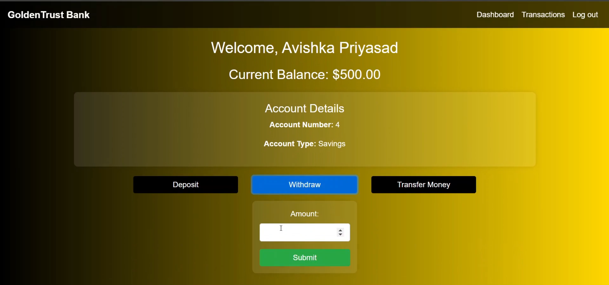

# GoldenTrust Bank 💳  

GoldenTrust Bank is a secure and user-friendly online banking web application. It allows users to perform essential banking operations, including deposits, withdrawals, and money transfers, while providing an intuitive dashboard and transaction history for easy account management.  

## Features 🚀  
- **Authentication**:  
  - Secure Login and Sign-Up functionality using Spring Security.  

- **Dashboard**:  
  - Displays account details and current balance.  
  - Provides quick actions for transactions.  

- **Transactions**:  
  - **Deposit**: Add funds to your account.  
  - **Withdraw**: Withdraw money securely.  
  - **Transfer Money**: Seamlessly transfer funds between accounts.  

- **Transaction History**:  
  - Track and view all past transactions.  

## Technologies Used 🛠  
### Back-End:  
- **Spring Boot**: For building a robust and scalable backend.  
- **Spring Security**: For user authentication and role-based access control.  

### Front-End:  
- **Thymeleaf**: For dynamic UI rendering.  
- **HTML** and **CSS**: For responsive and user-friendly design.  

### Database:  
- **MySQL**: For persistent data storage.  

## Installation and Setup ⚙️  

### Prerequisites:  
- Java Development Kit (JDK) 11 or later.  
- MySQL installed and running.  
- Apache Maven for dependency management.  

### Steps:  
1. Clone the repository:  
   ```bash  
   git clone <repository-link>  
   ```  

2. Navigate to the project directory:  
   ```bash  
   cd GoldenTrustBank  
   ```  

3. Configure the database:  
   - Create a MySQL database named `goldentrust_bank`.  
   - Update the `application.properties` file with your MySQL credentials:  
     ```properties  
     spring.datasource.url=jdbc:mysql://localhost:3306/goldentrust_bank  
     spring.datasource.username=your-username  
     spring.datasource.password=your-password  
     ```  

4. Build and run the application:  
   ```bash  
   mvn spring-boot:run  
   ```  

5. Access the application:  
   - Open your browser and go to `http://localhost:8080`.  

## Project Structure 📂  
- **Models**:  
  - `Account` and `Transaction` represent entities for account and transaction data.  
- **Controllers**:  
  - Handle HTTP requests and connect to services.  
- **Repositories**:  
  - Perform database operations.  
- **Services**:  
  - Business logic for transactions and account management.  
- **Views**:  
  - Thymeleaf templates for pages like login, register, dashboard, and transactions.  

## Interface 🖼  
### Dashboard:  
  

## Future Enhancements ✨  
- Add multi-factor authentication for improved security.  
- Integrate email notifications for transaction alerts.  
- Enhance UI/UX with modern front-end frameworks.    

## License 📜  
This project is licensed under the [MIT License](LICENSE).  


---  

